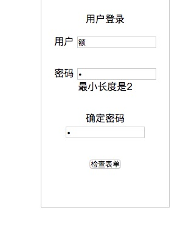

 jQuery Validate验证框架详解
===========================
## 配置和插入
**一、导入js库**

```
<script src="js/jquery-3.2.1.js"></script>
<script src="js/jquery.validate.js"></script>
```
**二、默认校验规则**


>(1)、required:true 必输字段
>(2)、remote:"remote-valid.jsp"   使用ajax方法调用remote-valid.jsp验证输入值
>(3)、email:true 必须输入正确格式的电子邮件
>(4)、url:true 必须输入正确格式的网址
>(5)、date:true 必须输入正确格式的日期，日期校验ie6出错，慎用
>(6)、dateISO:true                必须输入正确格式的日期(ISO)，例如：2009-06-23，1998/01/22 只验证格式，不验证有效性
>(7)、number:true 必须输入合法的数字(负数，小数)
>(8)、digits:true 必须输入整数
>(9)、creditcard:true 必须输入合法的信用卡号
>(10)、equalTo:"#password" 输入值必须和#password相同
>(11)、accept:                    输入拥有合法后缀名的字符串（上传文件的后缀）
>(12)、maxlength:5 输入长度最多是5的字符串(汉字算一个字符)
>(13)、minlength:10 输入长度最小是10的字符串(汉字算一个字符)
>(14)、rangelength:[5,10]         输入长度必须介于 5 和 10 之间的字符串")(汉字算一个字符)
>(15)、range:[5,10]               输入值必须介于 5 和 10 之间
>(16)、max:5                      输入值不能大于5
>(17)、min:10                     输入值不能小于10


**三、默认的提示**


```
messages: {
required: "This field is required.",
remote: "Please fix this field.",
email: "Please enter a valid email address.",
url: "Please enter a valid URL.",
date: "Please enter a valid date.",
dateISO: "Please enter a valid date (ISO).",
dateDE: "Bitte geben Sie ein g眉ltiges Datum ein.",
number: "Please enter a valid number.",
numberDE: "Bitte geben Sie eine Nummer ein.",
digits: "Please enter only digits",
creditcard: "Please enter a valid credit card number.",
equalTo: "Please enter the same value again.",
accept: "Please enter a value with a valid extension.",
maxlength: $.validator.format("Please enter no more than {0} characters."),
minlength: $.validator.format("Please enter at least {0} characters."),
rangelength: $.validator.format("Please enter a value between {0} and {1} characters long."),
range: $.validator.format("Please enter a value between {0} and {1}."),
max: $.validator.format("Please enter a value less than or equal to {0}."),
min: $.validator.format("Please enter a value greater than or equal to {0}.")
},
```

如需要修改，可在js代码中加入：


$.extend($.validator.messages, {
    required: "必选字段",
    remote: "请修正该字段",
    email: "请输入正确格式的电子邮件",
    url: "请输入合法的网址",
    date: "请输入合法的日期",
    dateISO: "请输入合法的日期 (ISO).",
    number: "请输入合法的数字",
    digits: "只能输入整数",
    creditcard: "请输入合法的信用卡号",
    equalTo: "请再次输入相同的值",
    accept: "请输入拥有合法后缀名的字符串",
    maxlength: $.validator.format("请输入一个长度最多是 {0} 的字符串"),
    minlength: $.validator.format("请输入一个长度最少是 {0} 的字符串"),
    rangelength: $.validator.format("请输入一个长度介于 {0} 和 {1} 之间的字符串"),
    range: $.validator.format("请输入一个介于 {0} 和 {1} 之间的值"),
    max: $.validator.format("请输入一个最大为 {0} 的值"),
    min: $.validator.format("请输入一个最小为 {0} 的值")
});


## 实战

```
<script>
    var validator;
    $(document).ready(function () {
        validator=$("#ee").validate({
            debug:true,
            debug:true,
            rules: {
                username: {
                    required: tru
//                    minlength: 2,
//                    maxlength: 6,
//                    rangelength:[2,10],
                    remote:{
                        url:"remote.json",
                        type:"post",
                        data:{
                            loginTime:function () {
                                return+new Date;
                            }
                        }
                    },
//                    email:true,
                },
                password: {
                    required: true,
                    minlength: 2,
                    maxlength: 6,
                },
                "comf-password": {
                    equalTo:"#password",
                }
            },
            messages: {
                username: {
                    required: "必填项目",
//                    minlength: "最小长度是2",
//                    maxlength: "最大长度是6",
                    rangelength:"最小长度为2，最大长度为10",
                    remote:"用户名不存在",
                },
                password: {
                    required: "必填项目",
                    minlength: "最小长度是2",
                    maxlength: "最大长度是6",
                }
            }
        });
        $("#check").click(function () {
            alert($("#ee").valid()?"填写正确":"填写错误");
        })
    });
</script>
```




